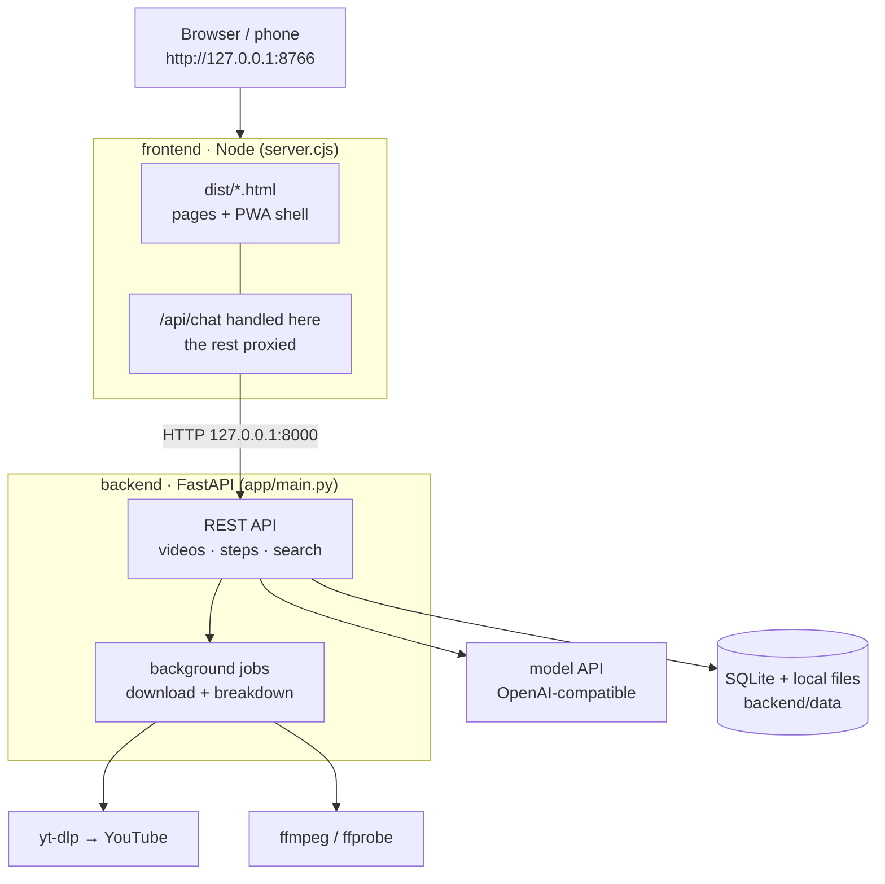
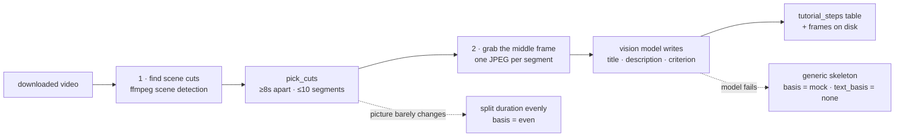

# slowly · CookClip

**English** | [中文](README.zh-CN.md)

A "follow-along" tutorial prototype: it turns a how-to video into "Step 1 … Step N", each step with
one representative frame and one pass criterion — then it sits next to you while you do it, checks
whether you actually got there, and lets you save it to come back to later.

The UI supports Chinese and English and remembers the selected language across pages. This README is
English-first; the Chinese version is [`README.zh-CN.md`](README.zh-CN.md).

## Scope: a local demo, not a production deployment

This repo is a **demo built to show the idea** — a showcase, not a service you can put on the
internet as-is. Everything runs on one local machine: the backend binds to `127.0.0.1:8000`, the
frontend to `127.0.0.1:8766` (set `HOST=0.0.0.0` only for the length of a LAN demo), data lives in a
local SQLite file plus a local folder, and the model key sits in a local `.env`.

Enterprise-grade / production-grade deployment is **not done yet** — it is tracked as follow-up work:

- [ ] user accounts, authentication and per-user data isolation
- [ ] request rate limiting and per-key quotas
- [ ] server-side secret management (no key on disk or in the frontend process)
- [ ] HTTPS behind a reverse proxy, plus a real ASGI deployment (workers, health checks, restarts)
- [ ] a real database instead of SQLite, with schema migrations
- [ ] object storage for videos and frames instead of local folders
- [ ] observability: structured logs, metrics, error reporting
- [ ] packaging: one container image and a one-command deploy

Until that list is done, treat every part of this repository as a demo.

## Architecture

Two processes, one config file. The browser only ever talks to the Node service on `:8766`; the
backend stays on `127.0.0.1:8000` and is reached through the proxy. That way a phone on the LAN can
only ever hit the frontend port — the backend, the downloader and the model key stay on your machine.



The step breakdown itself is a two-stage pipeline. Both stages are real and both can show their
evidence (the raw ffmpeg command and the screenshot they came from):



## Requirements

| | Version | Notes |
| --- | --- | --- |
| Python | 3.12+ | backend only |
| Node.js | 18+ | frontend has **no** dependencies to install |
| FFmpeg | any recent build | **both `ffmpeg` and `ffprobe`** are needed — `ffprobe` reads the duration, `ffmpeg` merges audio+video and grabs frames |
| Model API key | — | an OpenRouter key for the default free model, or a key for any OpenAI-compatible provider |

## Quick start

The backend and the frontend run in two separate terminals. Start the backend first.

### macOS / Linux

```bash
git clone https://github.com/suonnnnnnn/slowly-demo.git
cd slowly-demo

python3 -m venv .venv && source .venv/bin/activate
pip install -r requirements.txt

brew install ffmpeg            # macOS. Linux: use your package manager (apt / dnf / pacman)
cp .env.example .env           # then fill in the model key (see Configuration)
```

```bash
# terminal 1 — backend
cd backend && ../.venv/bin/python -m uvicorn app.main:app --port 8000

# terminal 2 — frontend
cd frontend && node server.cjs
```

### Windows

```powershell
git clone https://github.com/suonnnnnnn/slowly-demo.git
cd slowly-demo

python -m venv .venv
.\.venv\Scripts\python.exe -m pip install -r requirements.txt
Copy-Item .env.example .env    # then fill in the model key (see Configuration)
```

Install FFmpeg with the package manager of your choice, then point `FFMPEG_LOCATION` in `.env` at its
`bin` directory (e.g. `C:/Users/you/ffmpeg/bin`). Without it you get `ffmpeg is not installed` and
the breakdown degrades to a generic skeleton.

```bash
# terminal 1 — backend
cd backend && ../.venv/Scripts/python.exe -m uvicorn app.main:app --port 8000

# terminal 2 — frontend
cd frontend && node server.cjs
```

### Then open

http://127.0.0.1:8766/ — the chat home. Add `--reload` to the backend command if you want it to
restart on code changes.

Both services read `.env` once at startup, so **restart the relevant service after editing `.env`**.

## Configuration

Frontend and backend share one `.env` at the repository root:

```bash
cp .env.example .env    # fill in your own model key; never commit it
```

`frontend/server.cjs` reads `../.env`; `backend/app/config.py` reads `.env` at the repo root. Each
side ignores the keys it does not care about.

Text chat defaults to a free OpenRouter model — just fill in the key:

```bash
OPENROUTER_API_KEY=sk-or-v1-xxxxxxxx    # required for the default free model; never commit it
```

### Using another model provider

Chat and step checks talk to any **OpenAI-compatible** endpoint, so you can point the three
variables at whichever provider you use. Edit `.env`:

```bash
MODEL_API_BASE=https://your-provider.example/v1
MODEL_API_KEY=your-provider-key
MODEL_NAME=your-model-name              # pick a vision-capable model for step checks
```

Restart the frontend (`cd frontend && node server.cjs`) for it to take effect. To go back to the
built-in default, set `MODEL_API_BASE` to `https://openrouter.ai/api/v1`, `MODEL_NAME` to
`inclusionai/ling-3.0-flash-sante:free`, and make sure `OPENROUTER_API_KEY` is filled in.

The rule for the three variables: `MODEL_API_KEY` wins over `OPENROUTER_API_KEY`; `MODEL_API_BASE`
and `MODEL_NAME` fall back to the defaults baked into the code (the free OpenRouter model).

### Other settings that change behaviour

Everything else can stay empty. These few actually change what happens:

| Variable | Default | What it does |
| --- | --- | --- |
| `FFMPEG_LOCATION` | empty (find it on `PATH`) | the `bin` directory of ffmpeg. Needed by yt-dlp to merge audio+video and by step frame grabs; without it you get `ffmpeg is not installed` |
| `MODEL_VISION_ENABLED` | `true` | whether the photo a user attaches is sent to the model during a step check |
| `MODEL_VISION_NAME` | empty | a dedicated vision model; if empty, `MODEL_NAME` is used |
| `SEARCH_TIMEOUT_SECONDS` | `25` | total budget for one YouTube search subprocess (seconds). 8s is too tight — just `import yt-dlp` costs 1–2s |
| `SEARCH_SOCKET_TIMEOUT_SECONDS` | `10` | per-socket timeout. Smaller than the total budget so an unreachable network fails early with a real reason |
| `VIDEO_BACKEND_URL` | `http://127.0.0.1:8000` | where the frontend forwards search and step requests |
| `HOST` | `127.0.0.1` | frontend listen address. Set `0.0.0.0` to open it to the LAN (phone / PWA) — the startup log then prints the LAN URLs |
| `MAX_VIDEO_HEIGHT` | `720` | cap on download resolution. Step cards only use 640px-wide frames, so 1080p pixels are mostly thrown away, but the video page is watched by humans — 720p is the middle ground. Drop to `480` for a faster on-site demo |
| `DOWNLOAD_CONCURRENCY` | `4` | yt-dlp fragment concurrency. YouTube serves one https range, so the win is smaller than on HLS, but it is visible on long videos; `1` restores the single-connection behaviour |
| `FAST_SCENE_DETECT` | `true` | scene detection decodes I-frames only — measured ~6.6x faster (a 146s 1080p went from 9.5s to 1.4s). Set `false` for cuts identical to a full decode |
| `CAPTION_CONCURRENCY` | `6` | how many segments are captioned in parallel. Serial would take forever; too high risks rate limiting (a timed-out segment falls back to just its screenshot) |

See `.env.example` for the full list with comments.

## The four pages

All served as static files by the same Node service:

| Page | What it does |
| --- | --- |
| `index.html` (`/`) | Chat home. You ask something, the assistant answers and searches YouTube live; tap a result for a preview modal, tap "教程分解" to create a download job. The composer sits directly above the shared navigation, and "saved to do slowly" remains visible even before anything is saved |
| `library.html` | Material library. Uses the same 440 px app shell and warm yellow palette as Home and shows tutorials whose latest real breakdown completed successfully, with search and filters for cooking, everyday tools and other tutorials. The default free model classifies from the title and screenshot-derived step titles; keyword rules are the fallback. Neither implies whole-video understanding |
| `video.html?id=` | One video. Plays the original YouTube video while downloading, then switches to the local MP4. With `?start=&end=` it plays just that segment (this is where "watch only this part" on the steps page goes) |
| `steps.html?id=` | Step by step. Step strip + representative frame + "I did it" checkbox + "let the model check this step" + "ask when stuck"; you can save it, or re-break it down in one tap |

## How the steps are produced

Once the video is downloaded, `backend/app/breakdown.py` runs a **real** breakdown. The result lands
in the `tutorial_steps` / `tutorial_breakdowns` tables, and the representative frames land in
`backend/data/storage/frames/<video id>/<breakdown id>/`.

There are only two steps, and both can show their evidence:

1. **Find the scene cuts** — one decode pass of
   `ffmpeg -vf "select='gt(scene,0.2)',metadata=mode=print:key=lavfi.scene_score:file=-"` collects
   every frame-change score, then `pick_cuts()` picks boundaries from those scores (segments at
   least 8s apart, at most 10 segments). If the picture barely changes, it falls back to splitting
   the total duration evenly and marks `basis` as `even`.
2. **Let the model look at a screenshot** — for each segment, the middle frame is scaled to a small
   JPEG and sent to a vision model one segment at a time, asking for a title, a description, a
   self-check question and a pass criterion.

   The prompt (`breakdown.CAPTION_SYSTEM`) is deliberately tuned towards "what a cook would say"
   rather than "describe the picture": the title must be an action ("slice the onion thinly along
   the grain"), the description must say what this step achieves and why, and it is **explicitly
   forbidden** from starting with "in the frame / in the image / this frame". Ingredients it
   recognises are named directly; only unrecognised ones become "this ingredient" — never
   "white blocky object". Numbers, brands, names, and any "the video says…" are off-limits.

**What we deliberately do not do**: no speech transcription (no ASR), no OCR, no object detection.
The model sees exactly **one screenshot per segment**, so the UI says "what is in this frame", not
"what this segment is about". Every step carries two honesty markers:

| Field | Value | Meaning |
| --- | --- | --- |
| `basis` | `shots` | segment boundaries come from real scene changes |
| | `even` | the picture barely changed, so the duration was split evenly |
| | `mock` | a generic skeleton; not a single frame of this video was read (fallback when the breakdown fails) |
| `text_basis` | `model` | title / description / criterion were written by the model from this segment's screenshot |
| | `none` | nobody wrote them — only the frame is shown, you fill in the title yourself |

The breakdown runs in a background thread: `GET /steps` returns `analyzing: true` and the page polls
until it flips to `false`. Do not run it synchronously — the page would hang for half a minute. A
failed breakdown is recorded as `status="failed"` and falls back to the skeleton, but it is **not**
retried on every refresh (that would burn ffmpeg for nothing); use "re-break it down" to try again.

## API

The browser only ever talks to the Node service (`http://127.0.0.1:8766`): it serves the pages,
handles `/api/chat` itself (calling the backend's `/api/search` internally), and proxies everything
else straight to FastAPI.

| Method | Path | What it does |
| --- | --- | --- |
| POST | `/api/chat` | Text chat. Returns the reply, suggested follow-ups and YouTube search results |
| POST | `/api/videos` | Create a download job (the page then navigates to `/video.html?id=`) |
| GET | `/api/videos[?saved=1]` | Job list; `saved=1` for the saved ones only |
| GET | `/api/saved-tutorials` | The "saved to do slowly" list, with progress `step_total` / `step_done` |
| GET | `/api/library` | Successfully broken-down materials, with category and step progress |
| GET | `/api/videos/{id}` | Status of one job (download progress, whether it is saved) |
| POST | `/api/videos/{id}/save` | Save it; call again to unsave |
| GET | `/api/videos/{id}/content` | The downloaded local MP4 (supports Range) |
| GET | `/api/videos/{id}/steps` | Fetch the steps. The first request kicks off a background breakdown |
| POST | `/api/videos/{id}/steps/regenerate[?force=1]` | Re-break it down. Runs in the background and returns immediately; required `force=1` once there is progress |
| GET | `/api/videos/{id}/steps/{step_id}/frame` | This step's representative frame (JPEG) |
| PATCH | `/api/videos/{id}/steps/{step_id}` | Tick "I did it" / leave a note |
| POST | `/api/videos/{id}/steps/{step_id}/check` | Check whether this step passes |
| POST | `/api/videos/{id}/steps/{step_id}/ask` | Ask a question when stuck |

The backend also exposes `GET /api/health`, `GET /api/search`, `GET /api/videos/{id}/playback` and
`DELETE /api/videos/{id}`; the full reference is at `http://127.0.0.1:8000/docs`.

## Railway demo deployment

The root `Dockerfile` runs the public Node service and private FastAPI process in one container and
includes FFmpeg. Railway detects it automatically. Configure these service variables:

- `MODEL_API_KEY` or `OPENROUTER_API_KEY` for chat, frame captions and step checks.
- `MODEL_NAME` only when overriding the default free model.
- `MAX_VIDEO_HEIGHT=480` for a faster, lighter live demo.

Generate a public domain, set the health-check path to `/health`, and mount a Railway volume at
`/data` to preserve SQLite, downloaded videos and representative frames across restarts. Never put
API keys or exported YouTube cookies in the repository.

## Phone / PWA

The frontend is also a PWA: on a phone, "Add to Home Screen" / "Install app" and it opens full
screen with its own icon (see `frontend/README.md`). To reach it from a phone on the same network,
set `HOST=0.0.0.0` in `.env` first — the startup log then prints the LAN URLs. The demo has no
login, so prefer a personal hotspot over a shared Wi-Fi and set it back afterwards.

For a step-by-step setup, startup, phone-access and tear-down checklist — including the Windows
firewall rule, the macOS local-network prompt and the "Wi-Fi client isolation" trap — see
[`docs/demo-runbook.zh-CN.md`](docs/demo-runbook.zh-CN.md) (in Chinese).

## Prototype limits

Tutorial questions in the chat call FastAPI, which searches YouTube live. Clicking a result opens a
modal that plays the original YouTube video in the current page; only after you hit "教程分解" does
it create a download job and open a separate page. The original video keeps playing while
downloading, then switches to the local MP4 automatically.

The step breakdown is **real** (scene cuts + a vision model looking at representative frames), but it
only sees screenshots: it does not hear the audio and there is no transcription. So what the model
writes is "what is in this frame", not "what this segment is about"; burned-in subtitles are visible
to it, but the spoken explanation is not. The checking model has not watched the video either — it
only has the pass criterion, your description and an optional photo. The UI labels, for every step,
where the segment boundary and the text each came from. Search, download and step checks all report
failures honestly — a failure is never dressed up as "nothing found". Free models may be
rate-limited.

Both services bind to localhost only; add user authentication, request limits and server-side secret
management before deploying publicly.

For local YouTube downloads, explicitly authorize Chrome login access and set `YT_DLP_COOKIE_BROWSER=chrome`
in the local `.env`. macOS may request Keychain approval. This is opt-in, applies only to YouTube
URLs, and is overridden by `YT_DLP_COOKIE_FILE`. Never commit browser credentials.

## Repository layout

```text
.
├── AGENTS.md              working agreement (commit rules, honesty boundaries)
├── .env.example           shared config template for both ends
├── requirements.txt       backend Python dependencies
├── docs/
│   └── demo-runbook.zh-CN.md   on-site setup → demo → tear-down checklist (Chinese)
├── frontend/              frontend: Node service + static pages (no install needed)
│   ├── server.cjs         page routing, text chat, search + step/video API proxy
│   ├── chat-search.cjs    search result handling (unit test: chat-search.test.cjs)
│   └── dist/
│       ├── index.html     chat home: ask, live YouTube search, "saved to do slowly" entry
│       ├── library.html   material library: completed real breakdowns, search + category filters
│       ├── video.html     one video: download progress + playback (?start=&end= plays one segment)
│       └── steps.html     step-by-step: steps + frames + checks + Q&A
└── backend/               backend: FastAPI search + video storage + step breakdown
    ├── app/
    │   ├── main.py            every endpoint (video jobs / search / steps / saving)
    │   ├── video_analysis.py  ffprobe/ffmpeg wrapper: duration, scene cuts, frame grabs
    │   ├── breakdown.py       turn a video into steps (real; falls back to a generic skeleton)
    │   ├── coach.py           step checks, Q&A when you are stuck
    │   ├── search.py          YouTube search (yt-dlp subprocess, reports failures honestly)
    │   ├── models.py / schemas.py / database.py / storage.py
    │   ├── tasks.py / local_queue.py
    │   └── config.py / security.py
    ├── data/              generated at runtime: SQLite, downloaded videos, frames (not tracked)
    └── tests/             unit tests
```
