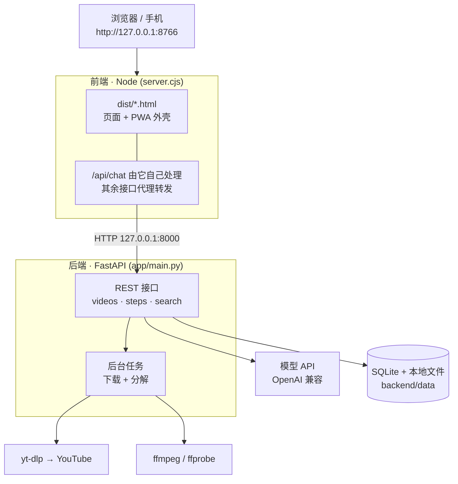
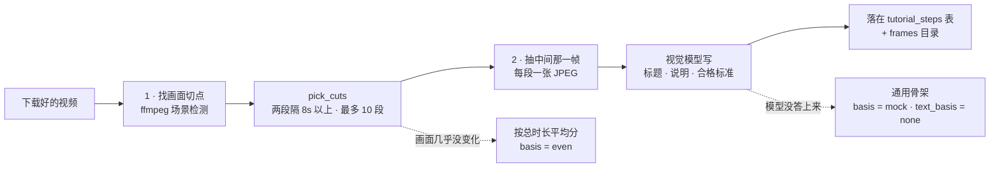

# 慢慢来 · CookClip

[English](README.md) | **中文**

教程陪做原型：把一个教程视频拆成「第 1 步…第 N 步」，每步配一张代表画面和一条合格标准；
有人陪你做、替你看这一步过没过，做完还能存下来下次接着做。

界面支持中英文切换，并会在主页、视频页、步骤页与素材库之间记住选择。

## 定位：本地演示，不是生产部署

这个仓库是**为了把想法演示出来**而做的 demo —— 是给人看的展示，不是可以直接丢到公网上跑的服务。
所有东西都跑在一台本机上：后端绑 `127.0.0.1:8000`，前端绑 `127.0.0.1:8766`（只在局域网演示期间
才设 `HOST=0.0.0.0`），数据存在本地 SQLite 文件 + 本地目录里，模型密钥放在本地 `.env` 里。

企业级 / 生产级部署**还没做**，属于待办（TODO），后续会继续完成：

- [ ] 用户账号、登录鉴权与用户间数据隔离
- [ ] 请求限流与按 key 的配额
- [ ] 服务端密钥管理（不再落盘、不放在前端进程里）
- [ ] 反向代理 + HTTPS，以及真正的 ASGI 部署（多 worker、健康检查、自动重启）
- [ ] 用正式数据库替换 SQLite，并引入数据迁移
- [ ] 视频与代表画面改用对象存储，而不是本地目录
- [ ] 可观测性：结构化日志、指标、错误上报
- [ ] 打包：一个容器镜像 + 一条命令部署

在这份清单完成之前，请把仓库里的每一部分都当作 demo 看待。

## 系统架构

两个进程，共用一份配置。浏览器只跟 `:8766` 上的 Node 服务说话；后端留在 `127.0.0.1:8000`，
由前端代理转发过去。这样局域网里的手机最多只能碰到前端端口——后端、下载器和模型密钥都留在本机。



步骤分解本身就是一条两段式链路。两段都是真跑，而且都拿得出证据（用了哪条 ffmpeg 命令、
来自哪张截图）：



## 环境要求

| | 版本 | 说明 |
| --- | --- | --- |
| Python | 3.12+ | 只有后端需要 |
| Node.js | 18+ | 前端**无需安装任何依赖** |
| FFmpeg | 较新的版本即可 | **`ffmpeg` 和 `ffprobe` 两个都要装**——`ffprobe` 读时长，`ffmpeg` 合并音视频、抽帧 |
| 模型密钥 | — | 默认免费模型用 OpenRouter 密钥，或任意 OpenAI 兼容提供方的密钥 |

## 快速开始

后端和前端分别在两个终端里跑，**先起后端**。

### macOS / Linux

```bash
git clone https://github.com/suonnnnnnn/slowly-demo.git
cd slowly-demo

python3 -m venv .venv && source .venv/bin/activate
pip install -r requirements.txt

brew install ffmpeg            # macOS。Linux 用你的包管理器（apt / dnf / pacman）
cp .env.example .env           # 然后填入模型密钥（见「配置」）
```

```bash
# 终端 1 —— 后端
cd backend && ../.venv/bin/python -m uvicorn app.main:app --port 8000

# 终端 2 —— 前端
cd frontend && node server.cjs
```

### Windows

```powershell
git clone https://github.com/suonnnnnnn/slowly-demo.git
cd slowly-demo

python -m venv .venv
.\.venv\Scripts\python.exe -m pip install -r requirements.txt
Copy-Item .env.example .env    # 然后填入模型密钥（见「配置」）
```

用你惯用的包管理器装好 FFmpeg，再把 `.env` 里的 `FFMPEG_LOCATION` 指到它的 `bin` 目录
（例如 `C:/Users/you/ffmpeg/bin`）。不配会报 `ffmpeg is not installed`，分解只能退回通用骨架。

```bash
# 终端 1 —— 后端
cd backend && ../.venv/Scripts/python.exe -m uvicorn app.main:app --port 8000

# 终端 2 —— 前端
cd frontend && node server.cjs
```

### 然后打开

http://127.0.0.1:8766/ 就是聊天首页。想改代码自动重载，给后端命令加 `--reload`。

两个服务都是启动时读一次 `.env`，所以**改完 `.env` 一定要重启对应服务**。

## 配置

前端和后端共用仓库根目录的同一个 `.env`：

```bash
cp .env.example .env    # 填入自己的模型密钥，勿提交密钥
```

`frontend/server.cjs` 读取 `../.env`，`backend/app/config.py` 读取仓库根目录的 `.env`，
两边都会忽略与自己无关的配置项。

文字对话默认使用 OpenRouter 的免费模型，在 `.env` 里填上密钥即可：

```bash
OPENROUTER_API_KEY=sk-or-v1-xxxxxxxx    # 默认免费模型必填；勿提交密钥
```

### 换成其他模型提供方

对话和步骤判定都走**任意 OpenAI 兼容**的接口，所以你可以把这三个变量指向自己在用的服务商。
编辑 `.env`：

```bash
MODEL_API_BASE=https://你的服务商/v1
MODEL_API_KEY=你的密钥
MODEL_NAME=你的模型名                # 步骤判定要用能看图的模型
```

保存后重启前端（`cd frontend && node server.cjs`）生效。想回到内置默认，把
`MODEL_API_BASE` 改回 `https://openrouter.ai/api/v1`、`MODEL_NAME` 改成
`inclusionai/ling-3.0-flash-sante:free`，并确保 `OPENROUTER_API_KEY` 已填写。

三个变量的规则：`MODEL_API_KEY` 优先于 `OPENROUTER_API_KEY`；`MODEL_API_BASE` 和 `MODEL_NAME`
不填时用代码里的默认值（OpenRouter 免费模型）。

### 会改变行为的其他配置

其余配置基本留空即可，下面这几个会实际影响行为：

| 变量 | 默认 | 作用 |
| --- | --- | --- |
| `FFMPEG_LOCATION` | 空（自动在 PATH 里找） | ffmpeg 的 `bin` 目录。yt-dlp 合并音视频和步骤抽帧都要用，缺了会报 `ffmpeg is not installed` |
| `MODEL_VISION_ENABLED` | `true` | 判定时要不要把用户传的照片一起发给模型 |
| `MODEL_VISION_NAME` | 空 | 指定一个专门看图的模型；留空就用 `MODEL_NAME` |
| `SEARCH_TIMEOUT_SECONDS` | `25` | 一次 YouTube 检索子进程的总预算（秒）。8 秒太紧——光 `import yt-dlp` 就要 1~2 秒 |
| `SEARCH_SOCKET_TIMEOUT_SECONDS` | `10` | 单次 socket 操作超时。比总预算小，连不上时能早点失败、报出真实原因 |
| `VIDEO_BACKEND_URL` | `http://127.0.0.1:8000` | 前端把检索和步骤请求转发到这里 |
| `HOST` | `127.0.0.1` | 前端监听地址。设成 `0.0.0.0` 就把页面开到局域网（手机 / PWA），启动日志会打印局域网地址 |
| `MAX_VIDEO_HEIGHT` | `720` | 下载清晰度上限。步骤卡片只用到 640px 宽的截图，1080p 的像素基本都被丢掉，但视频页要给人看，所以折中在 720p。现场想更强调速度可以调到 `480` |
| `DOWNLOAD_CONCURRENCY` | `4` | yt-dlp 的分片并发数。YouTube 是整段 https 下载，收益不如 HLS 明显，但长视频上能看到可见提速；设 `1` 就是原来的单连接行为 |
| `FAST_SCENE_DETECT` | `true` | 场景检测只解码 I 帧，实测快约 6.6 倍（146 秒的 1080p 从 9.5 秒降到 1.4 秒）。想拿到与全解码完全一致的切点就设 `false` |
| `CAPTION_CONCURRENCY` | `6` | 逐段问模型时的并发数。串行会等到天荒地老，调太高容易被限流（超时的那段会退回「只有截图」） |

完整清单和注释见 `.env.example`。

## 四个页面

都是同一个 Node 服务提供的静态文件：

| 页面 | 做什么 |
| --- | --- |
| `index.html`（`/`） | 聊天首页。提问后小慢会回答并在 YouTube 实时检索教程；点结果弹窗预览，点「教程分解」建下载任务。输入框直接放在底部导航上方；「存着慢慢做」入口始终显示 |
| `library.html` | 素材库。使用与主页一致的 440px 应用宽度和暖黄色系，只展示最新一次真实分解成功的教程，可搜索并按做饭、日常工具、其他教程筛选。默认免费模型按标题和代表截图生成的步骤标题分类，不可用时退回标题关键词；两者都不表示模型理解了整段视频 |
| `video.html?id=` | 单条视频页。下载期间播 YouTube 原视频，完成后自动切成本地 MP4；带 `?start=&end=` 时只播那一段（步骤页的「只看这一段」就是跳到这里） |
| `steps.html?id=` | 一步步做。步骤条 + 代表画面 + 勾「我做到了」+ 让小慢看这一步过没过 + 卡住了直接问；可以「存下来」，也可以一键重新分解 |

## 步骤是怎么拆出来的

视频下载完成后，`backend/app/breakdown.py` 会做一次真分解，结果落在 `tutorial_steps` /
`tutorial_breakdowns` 两张表里，代表画面落在 `backend/data/storage/frames/<视频 id>/<分解 id>/`。

链路只有两步，都是能拿出证据的：

1. **找画面切点** —— `ffmpeg -vf "select='gt(scene,0.2)',metadata=mode=print:key=lavfi.scene_score:file=-"`
   一趟解码拿到所有画面变化点和分数，再由 `pick_cuts()` 按分数挑边界（两段至少隔 8 秒、最多切 10 段）。
   画面几乎不变时退回按总时长平均分，并把 `basis` 标成 `even`。
2. **让模型看截图** —— 每段取中间那一帧缩成小 JPEG，逐段发给视觉模型，让它写标题、说明、自检问题和合格标准。

   提示词（`breakdown.CAPTION_SYSTEM`）刻意往「做菜的话」上拧，而不是「描述画面」：
   标题必须是动作指令（「把洋葱顺着纹路切成细丝」），说明要说清这一步要达成什么、为什么，
   并**明确禁止**用「画面中/图中/这一帧」开头。认得出的食材就直说，认不出的才说「这块食材」，
   不许写成「白色块状物」。数字、品牌、人名，以及「视频里说…」这类话一律不许编。

**刻意没有做的事**：没有语音转写（没接 ASR）、没有 OCR、没有目标检测。模型只看到每段的**一张截图**，
所以界面上写的是「这一帧里有什么」，不是「这一段讲了什么」。所有步骤都带两个诚实标记：

| 字段 | 取值 | 含义 |
| --- | --- | --- |
| `basis` | `shots` | 段边界来自真实画面切换 |
| | `even` | 画面几乎没变化，按总时长平均分 |
| | `mock` | 通用骨架，一个字都没读这个视频（拆失败时的兜底） |
| `text_basis` | `model` | 标题/说明/标准是模型看这一段截图写的 |
| | `none` | 没人写，只留了画面，标题要用户自己看 |

分解在后台线程里跑，`GET /steps` 会返回 `analyzing: true`，页面轮询等它变成 `false`——
不要在这里同步跑，不然页面会卡住半分钟。失败的分解会被记成 `status="failed"` 并退回骨架，
但**不会**每次刷新都自动重试，避免反复白烧 ffmpeg；要重来请用「重新分解」。

## 接口

浏览器只跟 Node 服务（`http://127.0.0.1:8766`）说话：页面由它提供，`/api/chat` 由它自己处理
（内部再去调后端的 `/api/search`），其余接口原样转发给 FastAPI。

| 方法 | 路径 | 作用 |
| --- | --- | --- |
| POST | `/api/chat` | 文字对话。返回回答、推荐问题和 YouTube 检索结果 |
| POST | `/api/videos` | 建下载任务（页面随后跳 `/video.html?id=`） |
| GET | `/api/videos[?saved=1]` | 任务列表；`saved=1` 只看存下的 |
| GET | `/api/saved-tutorials` | 「存着慢慢做」列表，带进度 `step_total` / `step_done` |
| GET | `/api/library` | 已成功真实分解的素材列表，带分类和步骤进度 |
| GET | `/api/videos/{id}` | 单条任务状态（下载进度、是否已存） |
| POST | `/api/videos/{id}/save` | 「存下来」；再调一次取消 |
| GET | `/api/videos/{id}/content` | 下载好的本地 MP4（支持 Range） |
| GET | `/api/videos/{id}/steps` | 拿步骤。首次访问会起一个后台分解 |
| POST | `/api/videos/{id}/steps/regenerate[?force=1]` | 重新分解。后台跑、立刻返回；已有进度时必须带 `force=1` |
| GET | `/api/videos/{id}/steps/{step_id}/frame` | 这一步的代表画面（JPEG） |
| PATCH | `/api/videos/{id}/steps/{step_id}` | 勾「我做到了」/ 留备注 |
| POST | `/api/videos/{id}/steps/{step_id}/check` | 判定这一步过没过 |
| POST | `/api/videos/{id}/steps/{step_id}/ask` | 卡住时问一句 |

后端另外还提供 `GET /api/health`、`GET /api/search`、`GET /api/videos/{id}/playback`、
`DELETE /api/videos/{id}`，完整文档在 `http://127.0.0.1:8000/docs`。

## Railway 演示部署

根目录的 `Dockerfile` 会在同一个容器里运行对外的 Node 服务和内部 FastAPI 服务，并已安装
FFmpeg。Railway 会自动识别它。需要在服务变量中配置：

- `MODEL_API_KEY` 或 `OPENROUTER_API_KEY`，用于聊天、画面描述和步骤检查。
- 仅在覆盖默认免费模型时设置 `MODEL_NAME`。
- 建议演示时设置 `MAX_VIDEO_HEIGHT=480`，下载和分解更轻、更快。

为服务生成公开域名，把健康检查路径设为 `/health`，并将 Railway Volume 挂载到 `/data`，
这样 SQLite、下载视频和代表画面在重启后仍会保留。不要把 API 密钥或导出的 YouTube Cookie
提交到仓库。

## 手机 / PWA

前端同时也是一个 PWA：手机上「添加到主屏幕」/「安装应用」即可全屏打开、有自己的图标
（见 `frontend/README.zh-CN.md`）。想在同一网络下的手机上打开，先把 `.env` 里的
`HOST` 设成 `0.0.0.0`，启动日志会打印局域网地址。这个 demo 没有登录，
建议用自己的手机热点而不是公共 WiFi，用完改回来。

从环境搭建、启动、手机访问到演示收尾的完整清单（含 Windows 防火墙规则、macOS 本地网络权限，
以及「WiFi 客户端隔离」这个最常见的坑），见 [`docs/demo-runbook.zh-CN.md`](docs/demo-runbook.zh-CN.md)。

## 原型限制

聊天中的教程问题会调用 FastAPI 在 YouTube 实时检索。点击结果会在当前聊天页弹窗播放 YouTube 原视频；
点击播放器右下角的“教程分解”后才开始下载并进入独立页面。下载期间继续播放原视频，完成后自动切换本地 MP4。

步骤分解是**真的**（画面切点 + 视觉模型看代表帧），但它只看截图、没听声音、没有字幕转写，
所以模型写的是「这一帧里有什么」而不是「这一段讲了什么」；画面里烧进去的字幕它看得见，视频的讲解内容它不知道。
判定模型同样没看过视频，只依据合格标准、你的描述和可选的照片。界面上每一步都标了这一段的边界和文字各是从哪来的。
检索、下载和判定都会如实报告失败，不会把失败说成“没搜到”。免费模型可能受限流影响。

两个服务都只监听本机地址；部署为公开服务前需添加用户认证、请求限额及服务端密钥管理。

本地下载 YouTube 时，经用户明确授权后可在 `.env` 设置 `YT_DLP_COOKIE_BROWSER=chrome`，读取 Chrome 登录状态。
macOS 可能请求钥匙串授权。仅对 YouTube 链接启用，默认关闭；`YT_DLP_COOKIE_FILE` 优先。不要提交浏览器凭证。

## 目录结构

```text
.
├── AGENTS.md              协作约定（提交规则、诚实边界）
├── .env.example           前后端共用的配置模板
├── requirements.txt       后端 Python 依赖
├── docs/
│   └── demo-runbook.zh-CN.md   现场搭建 → 演示 → 收尾清单
├── frontend/              前端：Node 服务 + 静态页面（无需安装依赖）
│   ├── server.cjs         页面路由、文字对话、检索与步骤/视频接口代理
│   ├── chat-search.cjs    检索结果处理（配 chat-search.test.cjs）
│   └── dist/
│       ├── index.html     聊天首页：提问、YouTube 检索、「存着慢慢做」入口
│       ├── library.html   素材库：已成功真实分解的教程、搜索与分类筛选
│       ├── video.html     单条视频页：下载进度 + 播放（?start=&end= 可只播一段）
│       └── steps.html     一步步做：步骤 + 代表画面 + 判定 + 问答
└── backend/               后端：FastAPI 检索 + 视频落库 + 步骤分解
    ├── app/
    │   ├── main.py            全部接口（视频任务 / 检索 / 步骤 / 保存）
    │   ├── video_analysis.py  ffprobe/ffmpeg 封装：读时长、找画面切点、抽帧
    │   ├── breakdown.py       把视频拆成一步步（真拆；拆不出来退回通用骨架）
    │   ├── coach.py           步骤判定、卡住时的问答
    │   ├── search.py          YouTube 检索（yt-dlp 子进程，失败如实报错）
    │   ├── models.py / schemas.py / database.py / storage.py
    │   ├── tasks.py / local_queue.py
    │   └── config.py / security.py
    ├── data/              运行时生成：SQLite、下载的视频、代表画面（不入库）
    └── tests/             单元测试
```
